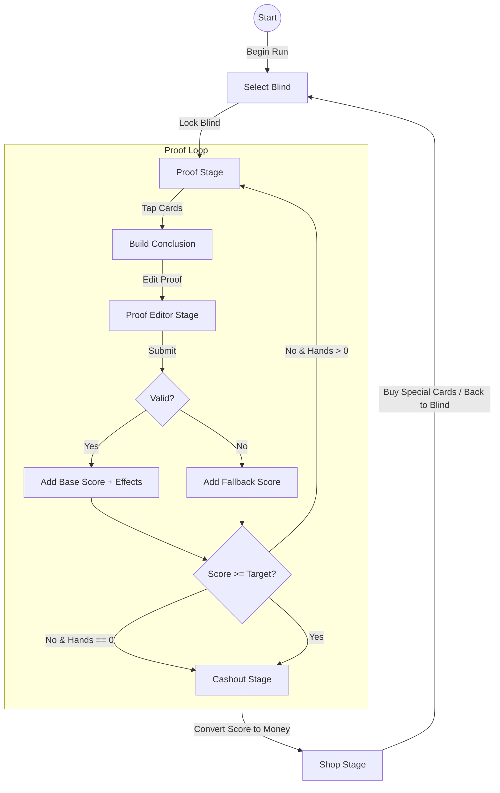

# 1.0 Overview & Architecture

## Goal

Port the Unity prototype **Boolatro** gameplay loop into a Flutter codebase that follows the existing **cruising** project style.

核心玩法：
- 类 Balatro 的 run structure（Start / Blind / Shop / …）
- **每一个盲注（Blind）是一道逻辑证明题**：玩家构造 proof，通过验证并结算得分，达标后进入结算与商店。

## Gameplay Flow

## Architecture

We follow the **cruising** pattern combined with **Flame Engine** for high-performance game rendering:

- **Single source of truth**: A `ChangeNotifier` state object (`RunState`) manages the entire game state.
- **Ticker-based loop**: The game follows a consistent delta-time update loop.
- **Flame Engine Integration**:
  - **BoolatroGame (FlameGame)**: The root container holding the `RunState` and managing the component tree.
  - **Component Architecture**: UI elements (Scoring Panel, Hand, Joker Row) are autonomous Flame `Components` that listen to `RunState`.
  - **Hybrid Rendering**: 
    - **Flame Components** for game elements and animations.
    - **Flutter Overlays** for complex text input (like the `ProofEditor`).

## Core Modules

- `RunState`: The orchestrator of the game flow and state.
- `proof_core/`: Pure Dart logic for formula generation, validation, and base scoring.
- `effects/`: Extensible effect system for special cards.
- `lib/game/components/`: Flame-based UI components.

## Milestones (Unity to Flutter Porting)

- ✅ **Core Engine**: Flame integration, RunState, and basic phase flow.
- ✅ **Proof Logic**: Formula generation, validation, and scoring system port.
- ✅ **Stage UI**: Select Blind, Proof Editor (Simplified), and Cashout UI.
- ✅ **Effect System**: Shop logic and Special Card effects implementation.
- ⏳ **Polish**: UI animations, advanced effects, and balanced task generation.
