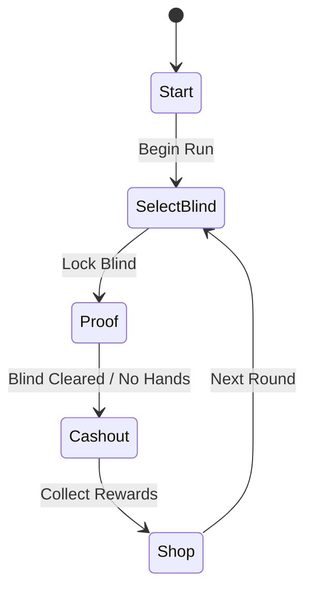

# 2.1 Phase Flow

## 核心流程 (Core Game Loop)

## 各阶段详细说明 (Stage Details)

### 1. Start Phase
- 展示游戏标题，点击 "Begin Run" 初始化 `RunState` 并进入 `SelectBlind`。

### 2. SelectBlind Phase
- 玩家选择当前的盲注（Blind）。
- 每个盲注具有不同的 `targetScore` 和难度等级。
- 点击 "Lock Blind" 锁定并进入 `Proof` 阶段。

### 3. Proof Phase
- **证明构造 (Construction)**: 玩家从底部手牌中选择逻辑符号，构造 `Conclusion`。
- **证明编辑器 (Proof Editor)**:
  - 点击 "Edit Proof" 进入全屏编辑器。
  - **消耗手牌**: 进入编辑器立即扣除一次 `handsRemaining`。
  - **输入证明**: 填写 `Sentence`, `Rule` 和 `Citations`。
- **提交与结算 (Submission)**:
  - 点击 "Submit" 进行逻辑验证。
  - **计分**: 有效证明获得基础分 + 效果加成；无效证明获得补偿分。
  - **判定**: 如果总分达到 `targetScore`，进入 `Cashout`；否则若仍有手牌，可继续编辑。

### 4. Cashout Phase
- 结算当前盲注的奖励。
- 将得分转化为金钱（Money），并根据剩余手牌提供额外奖励。

### 5. Shop Phase
- 展示随机生成的特殊卡牌（Special Cards）。
- 玩家可以使用金钱购买卡牌，受限于 `inventoryLimit`。
- 点击 "Next Round" 返回 `SelectBlind` 开始下一轮。

## 状态管理 (State Management)
- `RunState` 是整个流程的编排者。
- 通过 `GamePhase` 枚举驱动 Flame `StageComponent` 的子组件切换。
