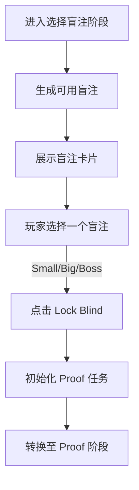

# 2.2 Feature - Select Blind

## 目标

实现 **Select Blind Phase (选择盲注阶段)**，允许玩家在开始逻辑证明挑战之前选择不同的盲注（难度和奖励等级）。

## 流程图

## 核心设计

### 1. 盲注类型 (Blind Types)
- **Small Blind**: 低目标分数 (120)，基础奖励。**（当前版本仅实现了此类型）**
- **Big Blind**: 高目标分数，更高金钱奖励。（计划中）
- **Boss Blind**: 具有特殊负面效果或更高的过关门槛，通关后提升 Ante（轮数）。（计划中）

### 2. 任务生成 (Task Initialization)
- 锁定盲注后，根据当前 Ante 和盲注难度，调用 `ProofTaskGenerator` 生成对应的逻辑题（Premise 和 Conclusion）。

## UI 表现
- **SelectBlindStage (Flame Component)**:
  - 居中展示大型盲注卡片。
  - 显示目标分数和潜在奖励。
  - 底部提供 "Lock Blind" 确认按钮。

## 后续迭代
- 实现 Boss Blind 的特殊限制规则。
- 完善 Ante 系统，随游戏进程动态调整盲注难度系数。
