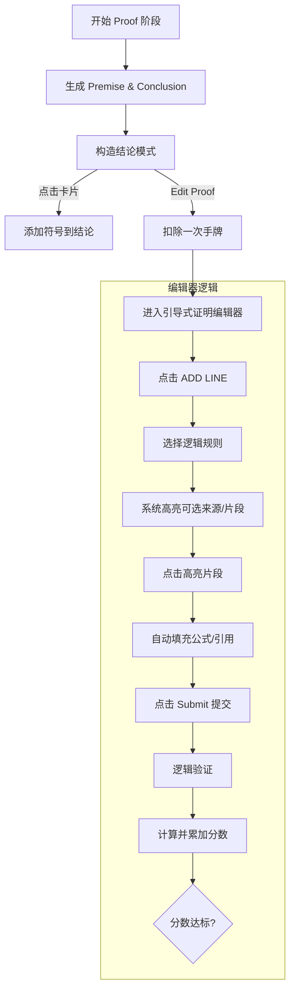

# 2.3 Feature - Proof Phase

## 目标

实现游戏的核心玩法：**Proof Phase (证明阶段)**。玩家需要构造一个结论，并编写完整的逻辑证明过程来获取分数，以达成盲注的目标。

## 流程图

## 核心机制 (Mechanics)

### 1. 任务生成 (Task Generation)
- 使用 `ProofTaskGenerator` 根据当前难度和电路等级生成 `Premise`。
- `Conclusion` 由玩家自行构造（目前版本），或由系统预设。

### 2. 逻辑验证系统 (Validation)
由 `ProofValidator` 负责：
- **WFF 检查**: 确保所有输入的公式符合逻辑语法。
- **规则验证**: 支持以下逻辑规则：
  - `reit`: 重复。
  - `&elim`: 合取消除。
  - `&intro`: 合取引入。
  - `~elim`: 双重否定消除。
  - `~intro`: 双重否定引入。
- **完整性验证**: 验证最后一行证明是否与目标结论完全一致。

### 3. 计分系统 (Scoring)
- **有效证明**: 基于证明行数、公式复杂度和特殊卡牌效果计算。
- **无效证明**: 给予少量“安慰分”（Fallback Score）。

### 4. 资源管理 (Resources)
- **手牌 (Hands)**: 进入编辑器即消耗一次。手牌归零且未达标则游戏失败，系统重置并返回 `Start` 阶段。
- **符号手牌 (Symbol Hand)**: 底部用于构造结论的符号卡片，在退出编辑器时会自动补充。

## UI 实现
- **StageComponent**: 负责在“构造模式”和“编辑模式”之间切换。
- **ProofEditor (Guided Flow)**: 
  - **无需键盘**: 全部交互通过点击完成。
  - **引导式输入**: 采用“先选规则，后点来源”的流程。
  - **交互式公式 (FormulaView)**: 前序行中的公式段落（如合取项）在特定条件下会变为可点击状态，点击即可自动填入当前行。
- **ScoringPanel**: 实时反馈当前分数、目标分数及剩余手牌。

## 状态管理
- `ProofState`: 维护当前证明任务、已构造结论、编辑器草稿及验证反馈。
- `RunState`: 协调阶段流转，并作为 `EffectEngine` 的入口应用各种特殊卡牌加成。
