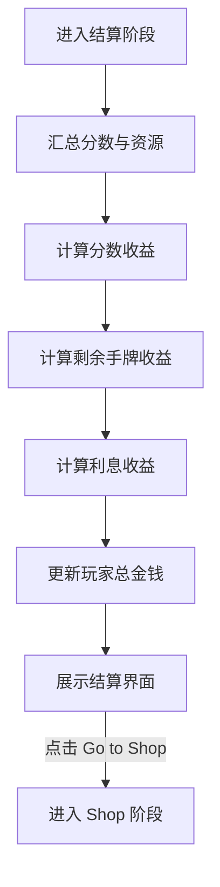

# 2.4 Feature - Cashout

## 目标

实现 **Cashout Phase (结算阶段)**，作为 Proof 阶段后的过渡，将玩家的表现（分数、剩余资源）转化为可用于商店消费的金钱（Money）。

## 流程图

## 结算逻辑

### 1. 收益构成
- **Base Payout**: 完成盲注的基础奖励。
- **Hand Bonus**: 每一剩余的手牌 (`handsRemaining`) 提供的额外金钱。
- **Interest**: 基于当前持有的金钱，每 5 元产生 1 元利息（最高 5 元）。

### 2. 特殊加成
- 某些特殊卡牌可能在结算时触发 `onRoundEnd`，提供额外的金钱或资源加成。

## UI 表现
- **CashoutStage (Flame Component)**:
  - 采用“收据”样式的 UI。
  - 逐项列出收益条目（分数奖励、手牌奖励、利息等）。
  - 显示最终获得的金额总数。
  - 底部提供进入商店的跳转按钮。

## 后续迭代
- 丰富结算动画效果。
- 完善结算阶段与特殊卡牌系统的集成。
