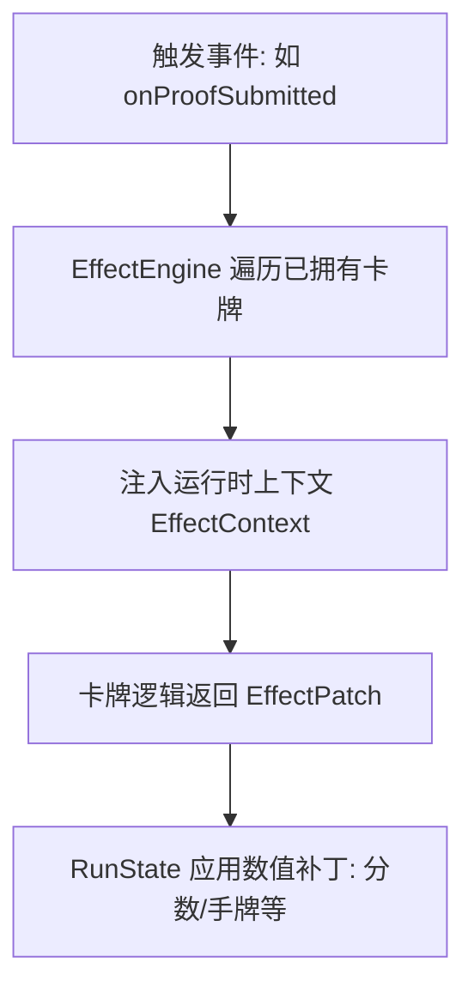
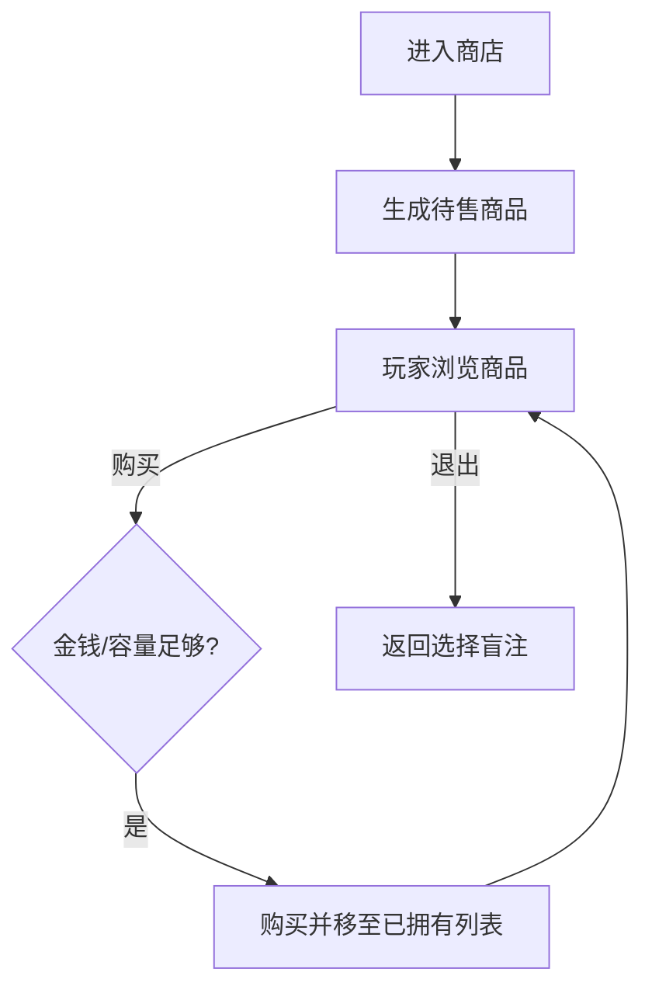

# 2.5 Feature - Shop & Effects

## 目标

实现 **Shop (商店)** 系统和 **Effect System (效果系统)**。该系统允许玩家购买具有持久加成能力的特殊卡牌（Special Cards），并通过一个解耦的引擎在特定时机应用效果。

## 架构概览

### 1. 效果系统流程 (Effect System Flow)

### 2. 商店流程 (Shop Flow)

## 核心模块

### 1) EffectTrigger (触发器)
定义了效果触发的时机：
- `onRoundStart`: 盲注开始。
- `onProofSubmitted`: 提交证明时。
- `onRoundEnd`: 盲注结束结算。
- `onShopEnter/onShopExit`: 商店交互。

### 2) EffectContext (上下文)
携带运行时数据，如：是否验证通过、当前基础分、剩余手牌等。

### 3) EffectPatch (效果补丁)
卡牌逻辑返回的一个简单对象，用于定义属性的增减（如 `addScore`, `addHands`）。

### 4) SpecialCard (特殊卡牌)
所有特殊卡牌的基类，包含 `onTrigger(ctx)` 方法。采用纯 Dart 实现，便于测试。

## UI 实现
- **ShopStage (Flame Component)**:
  - 展示货架上的待售卡牌。
  - 显示卡牌价格、描述及其特殊效果。
  - 玩家点击购买后，卡牌即时进入顶部 `JokerRowComponent`。

## 状态管理
- `ShopState`: 维护玩家金钱、库存限制、已拥有卡牌和当前货架库存。
- `RunState`: 在各个生命周期钩子中调用 `EffectEngine`。
